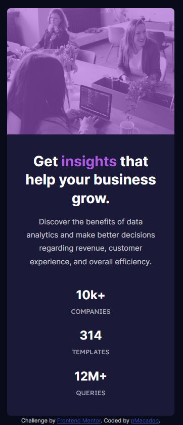

# Frontend Mentor - Stats preview card component solution

This is a solution to the [Stats preview card component challenge on Frontend Mentor](https://www.frontendmentor.io/challenges/stats-preview-card-component-8JqbgoU62). Frontend Mentor challenges help you improve your coding skills by building realistic projects. 

## Table of contents

- [Overview](#overview)
  - [The challenge](#the-challenge)
  - [Screenshots](#screenshots)
  - [Links](#links)
- [My process](#my-process)
  - [Built with](#built-with)
  - [Continued development](#continued-development)
- [Author](#author)

## Overview

### The challenge

Users should be able to:

- View the optimal layout depending on their device's screen size

### Screenshots

### Links

- Solution URL: [https://github.com/pMacadoo/fem-stats-preview-card-component-main](https://github.com/pMacadoo/fem-stats-preview-card-component-main)
- Live Site URL: [https://reliable-pothos-7d55c9.netlify.app/](https://reliable-pothos-7d55c9.netlify.app/)

## My process

### Built with

- Semantic HTML5 markup
- CSS custom properties
- Flexbox
- CSS Grid
- Mobile-first workflow
- Responsive design

### Continued development

Iteration is my goal. The more I code designs the better developed my muscle memory and problem solving skills will get.

## Author

- GitHub - [pMacadoo](https://github.com/pMacadoo)
- Frontend Mentor - [@pMacadoo](https://www.frontendmentor.io/profile/pmacadoo)